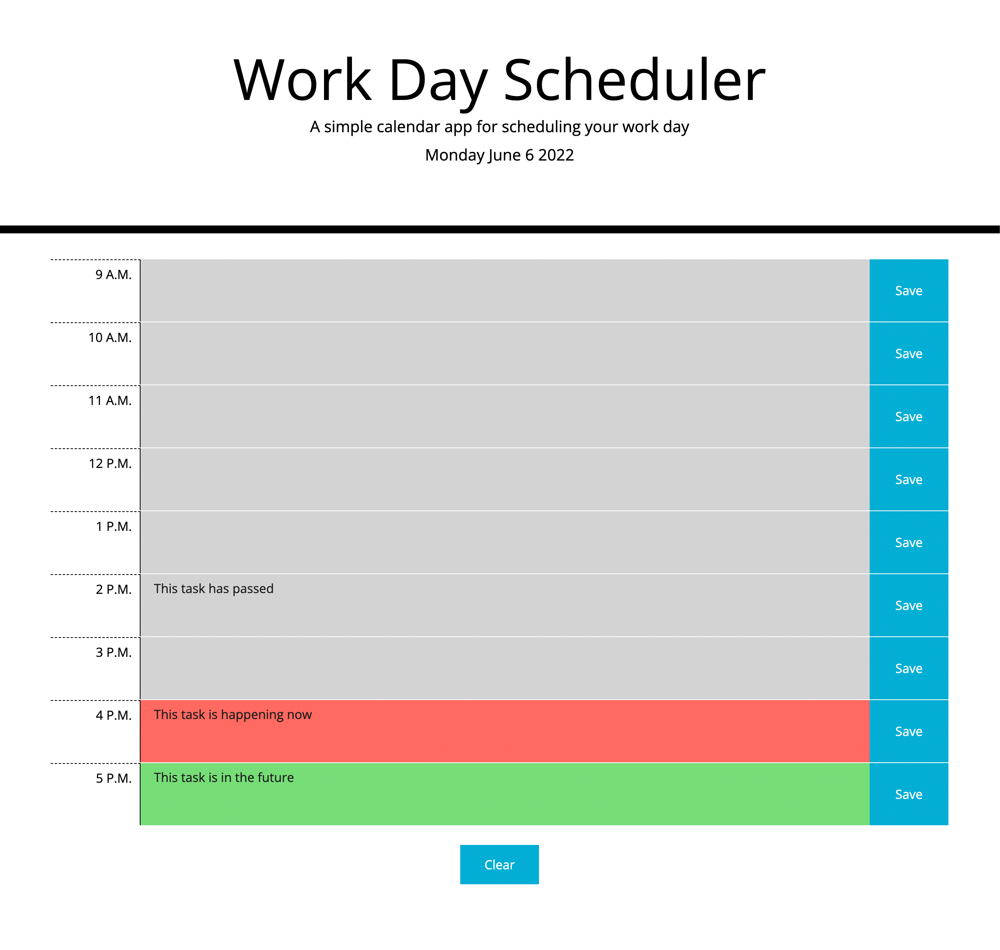

# Work Day Scheduler Starter Code

## Description  
Plan out your day with this simple and easy to use daily planner. 

## Screenshot

## Usage.   
* Each row is a textarea where you can type any tasks/events planned for the day. Click on the corresponding save button to save to your local storage.   
* Click the clear button at the bottom of the application to reset your day!
* Each time row will change background color based on the current time. Grey means an event has passed. Red means an even is happening now! Green means an event is in the future.

## Deployed Application
[https://j0j0c0ding.github.io/workday-planner/](https://j0j0c0ding.github.io/workday-planner/)

  
